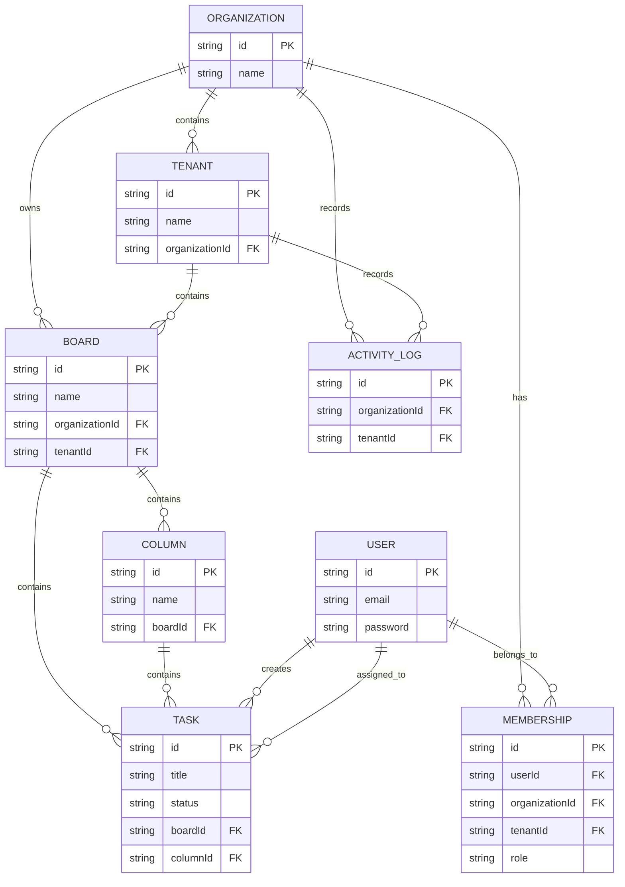

# Database ER Diagram

```mermaid
erDiagram
    ORGANIZATION ||--o{ TENANT : contains
    ORGANIZATION ||--o{ MEMBERSHIP : has
    USER ||--o{ MEMBERSHIP : belongs_to
    ORGANIZATION ||--o{ BOARD : owns
    TENANT ||--o{ BOARD : contains
    BOARD ||--o{ COLUMN : contains
    BOARD ||--o{ TASK : contains
    COLUMN ||--o{ TASK : contains
    USER ||--o{ TASK : creates
    USER ||--o{ TASK : assigned_to
    ORGANIZATION ||--o{ ACTIVITY_LOG : records
    TENANT ||--o{ ACTIVITY_LOG : records

    ORGANIZATION {
        string id PK
        string name
    }

    TENANT {
        string id PK
        string name
        string organizationId FK
    }

    USER {
        string id PK
        string email
        string password
    }

    MEMBERSHIP {
        string id PK
        string userId FK
        string organizationId FK
        string tenantId FK
        string role
    }

    BOARD {
        string id PK
        string name
        string organizationId FK
        string tenantId FK
    }

    COLUMN {
        string id PK
        string name
        string boardId FK
    }

    TASK {
        string id PK
        string title
        string status
        string boardId FK
        string columnId FK
    }

    ACTIVITY_LOG {
        string id PK
        string organizationId FK
        string tenantId FK
    }
```
